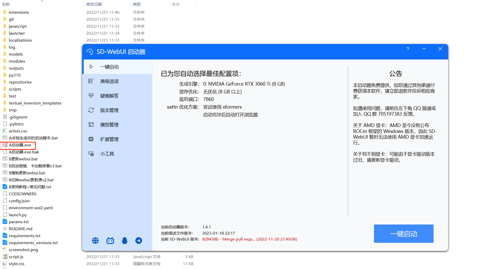
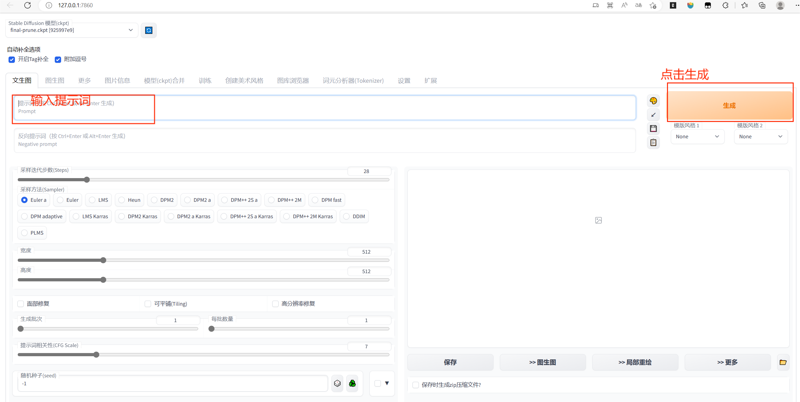

# AI绘画

## AI绘画安装

### 安装软件

- novelai-webui-aki-v2.zip
- 启动器运行依赖-dotnet-6.0.11.exe
- webui启动器.zip

### 安装步骤

1. 解压`novelai-webui-aki-v2.zip`到安装目录
2. 运行`启动器运行依赖-dotnet-6.0.11.exe`
3. 解压`webui启动器.zip`,将里面的内容复制`novelai-webui-aki-v2.zip`的解压目录中

## AI绘画使用

1. 运行`A启动器.exe`，出现SD-WebUI启动器窗口

2. 点击一键启动
3. 访问`http://127.0.0.1:7860` ，[链接](http://127.0.0.1:7860/)
4. 输入提示词，点击生成按钮

